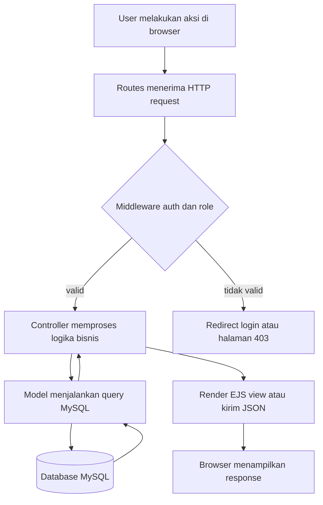
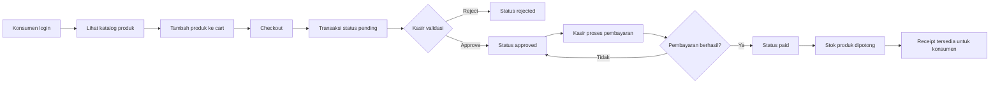
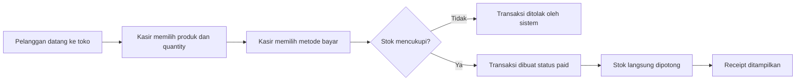
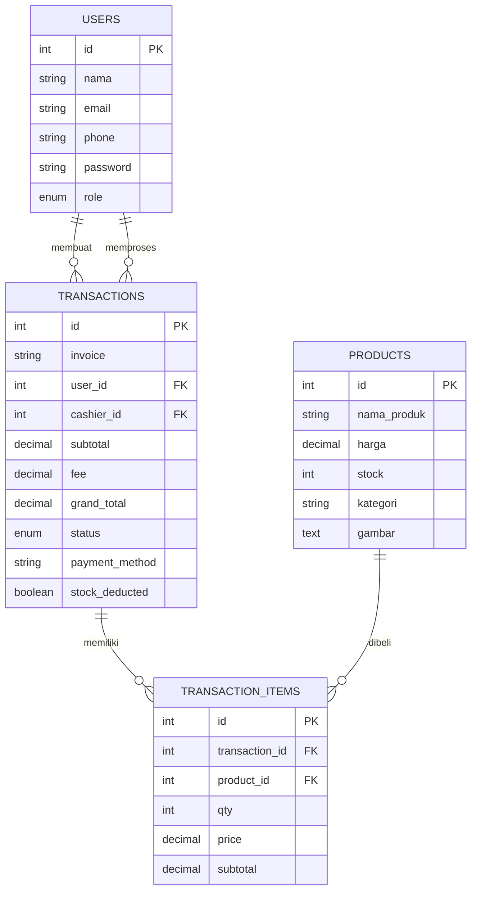

Anggota kelompok :
1. Rahma Aulia Khoirunnisa 714240057
2. Revania Zahrani Ramadeani 714240021
3. Ismi Nabilah 714240056

# WarungPOS - Sistem Point of Sale Multi-Role

WarungPOS adalah sistem informasi Point of Sale (POS) berbasis web untuk membantu pengelolaan transaksi penjualan, pemesanan mandiri, pembayaran, stok produk, dan laporan keuangan pada unit usaha retail atau warung modern.

Aplikasi ini dibangun menggunakan Node.js, Express, MySQL, EJS, dan Tailwind CSS. Struktur aplikasinya mengikuti pola Model-View-Controller (MVC), sehingga pemrosesan route, logika bisnis, akses database, dan tampilan pengguna dipisahkan ke dalam folder yang jelas.

---

## 1. Panduan Gambar Workflow

> [!IMPORTANT]
> Gambar workflow belum disertakan di repository ini. Setelah diagram dibuat, simpan gambar di root project atau folder `public/` lalu sesuaikan path gambar di bagian ini. Jika mengikuti nama yang direncanakan, gunakan nama file seperti `worflowpos.png`.

Contoh jika gambar disimpan di root project dengan nama `worflowpos.png`:

```md

```

Contoh jika gambar disimpan di folder `public/images/`:

```md

```

---

## 2. Deskripsi & Konteks Sistem

### 2.1 Deskripsi Aplikasi

WarungPOS dirancang untuk mendukung dua pola transaksi utama:

1. Pembelian mandiri oleh konsumen melalui katalog digital.
2. Penjualan langsung oleh kasir untuk pelanggan yang datang ke toko.

Pada alur pembelian mandiri, konsumen dapat memilih produk, memasukkan barang ke keranjang, checkout, lalu menunggu validasi kasir. Stok produk baru dipotong setelah transaksi benar-benar dibayar dan berstatus `paid`.

Pada alur penjualan langsung, kasir memilih produk dan metode pembayaran secara langsung. Jika stok mencukupi, transaksi langsung dibuat dengan status `paid` dan stok produk otomatis berkurang.

### 2.2 Stakeholder & Hak Akses

| Role | Peran dalam Sistem | Tanggung Jawab Utama |
| --- | --- | --- |
| Manager | Pengambil keputusan dan pemantau bisnis | Melihat KPI penjualan, grafik performa, transaksi terbaru, performa kasir, serta export laporan CSV/PDF. |
| Operator | Pengelola inventaris | Mengelola data produk, kategori, harga, stok, dan gambar produk. |
| Kasir | Verifikator transaksi dan pembayaran | Approve/reject pesanan konsumen, memproses pembayaran, membuat direct sale, dan melihat struk transaksi. |
| Konsumen | Pembeli mandiri | Melihat katalog, mengelola cart, checkout, memantau status pesanan, melihat riwayat, dan mengunduh receipt PDF. |

### 2.3 Batasan Sistem

1. **Otentikasi berbasis session**
   Aplikasi menggunakan `express-session`. User yang belum login akan diarahkan ke halaman `/login`.

2. **Role-Based Access Control**
   Setiap dashboard hanya dapat diakses oleh role yang sesuai. Jika user mencoba mengakses halaman role lain, sistem menampilkan halaman error `403`.

3. **Session timeout**
   Session pengguna otomatis kedaluwarsa setelah 30 menit tidak aktif.

4. **Pengurangan stok berbasis status pembayaran**
   Stok produk tidak dikurangi saat transaksi masih `pending` atau `approved`. Stok baru dikurangi ketika transaksi menjadi `paid`.

5. **SmartBank dummy API**
   Pembayaran SmartBank pada aplikasi ini adalah simulasi. Sistem membuat `payment_request_id` dummy dan mengembalikan status `success` atau `failed` secara acak.

---

## 3. Fitur Utama & Alur Input-Proses-Output

### 3.1 Autentikasi Multi-Role

- **Input:** email dan password user.
- **Proses:** sistem memvalidasi input, mencari user berdasarkan email, membandingkan password menggunakan `bcrypt`, lalu menyimpan data user ke session.
- **Output:** user diarahkan ke dashboard sesuai role: `/manager`, `/operator`, `/kasir`, atau `/konsumen`.

### 3.2 Katalog & Checkout Konsumen

- **Input:** pencarian produk, filter kategori, item cart, quantity, dan aksi checkout.
- **Proses:** sistem menyimpan cart di session, memvalidasi stok, menghitung subtotal, fee layanan, grand total, lalu membuat transaksi dengan status awal `pending`.
- **Output:** konsumen diarahkan ke halaman waiting approval dan dapat memantau status transaksi.

### 3.3 Approval Pesanan oleh Kasir

- **Input:** ID transaksi dengan status `pending`.
- **Proses:** kasir memeriksa detail transaksi, lalu memilih `approve` atau `reject`.
- **Output:** status transaksi berubah menjadi `approved` atau `rejected`.

### 3.4 Pembayaran Transaksi

- **Input:** ID transaksi approved dan metode pembayaran.
- **Proses:** sistem memvalidasi status transaksi, mengecek ulang stok, memproses pembayaran manual atau SmartBank dummy, lalu mengubah status menjadi `paid` jika berhasil.
- **Output:** stok produk berkurang, transaksi tercatat sebagai penjualan selesai, dan struk dapat ditampilkan.

### 3.5 Direct Sale oleh Kasir

- **Input:** produk, quantity, dan metode pembayaran.
- **Proses:** sistem mengecek stok real-time, menghitung subtotal, fee, grand total, membuat transaksi langsung berstatus `paid`, dan memotong stok produk.
- **Output:** kasir diarahkan ke halaman receipt transaksi.

### 3.6 Manajemen Produk oleh Operator

- **Input:** nama produk, harga, stok, kategori, dan gambar.
- **Proses:** operator dapat menambah, mengubah, memperbarui stok, atau menghapus data produk.
- **Output:** data produk pada tabel `products` diperbarui dan langsung tampil di katalog konsumen serta dashboard kasir.

### 3.7 Monitoring dan Laporan Manager

- **Input:** filter periode laporan seperti `today`, `week`, `month`, atau `all`.
- **Proses:** sistem mengambil data transaksi `paid`, menghitung KPI, membuat grafik penjualan, menampilkan performa kasir, dan menyiapkan data export.
- **Output:** dashboard manager menampilkan ringkasan penjualan dan dapat mengunduh laporan dalam format CSV/PDF.

---

## 4. Workflow Sistem

### 4.1 Workflow Arsitektur MVC



### 4.2 Workflow Pembelian Mandiri Konsumen



### 4.3 Workflow Direct Sale Kasir



---

## 5. Skema Database

WarungPOS menggunakan database MySQL dengan 4 tabel inti.

### 5.1 Tabel `users`

| Kolom | Tipe | Keterangan |
| --- | --- | --- |
| `id` | INT, PK | ID user. |
| `name` | VARCHAR(100) | Nama user versi lama/kompatibilitas. |
| `nama` | VARCHAR(100) | Nama user yang digunakan aplikasi. |
| `email` | VARCHAR(100), UNIQUE | Email login. |
| `phone` | VARCHAR(30) | Nomor telepon user. |
| `password` | VARCHAR(255) | Password hash `bcrypt`. |
| `role` | ENUM | `manager`, `operator`, `kasir`, `konsumen`. |
| `created_at` | TIMESTAMP | Waktu user dibuat. |

### 5.2 Tabel `products`

| Kolom | Tipe | Keterangan |
| --- | --- | --- |
| `id` | INT, PK | ID produk. |
| `nama_produk` | VARCHAR(150) | Nama produk. |
| `harga` | DECIMAL(12,2) | Harga jual produk. |
| `stock` | INT | Jumlah stok tersedia. |
| `kategori` | VARCHAR(100) | Kategori produk. |
| `gambar` | TEXT | Path atau URL gambar produk. |
| `created_at` | TIMESTAMP | Waktu produk dibuat. |

### 5.3 Tabel `transactions`

| Kolom | Tipe | Keterangan |
| --- | --- | --- |
| `id` | INT, PK | ID transaksi. |
| `invoice` | VARCHAR(50), UNIQUE | Nomor invoice transaksi. |
| `user_id` | INT, FK | ID konsumen, dapat kosong untuk direct sale. |
| `cashier_id` | INT, FK | ID kasir yang memproses transaksi. |
| `subtotal` | DECIMAL(12,2) | Total harga item sebelum fee. |
| `fee` | DECIMAL(12,2) | Fee layanan POS. |
| `grand_total` | DECIMAL(12,2) | Total akhir pembayaran. |
| `status` | ENUM | `pending`, `approved`, `paid`, `rejected`. |
| `payment_method` | VARCHAR(50) | Metode pembayaran. |
| `stock_deducted` | TINYINT(1) | Penanda apakah stok sudah dikurangi. |
| `created_at` | TIMESTAMP | Waktu transaksi dibuat. |

### 5.4 Tabel `transaction_items`

| Kolom | Tipe | Keterangan |
| --- | --- | --- |
| `id` | INT, PK | ID detail transaksi. |
| `transaction_id` | INT, FK | Relasi ke tabel `transactions`. |
| `product_id` | INT, FK | Relasi ke tabel `products`. |
| `qty` | INT | Jumlah produk dibeli. |
| `price` | DECIMAL(12,2) | Harga satuan saat transaksi dibuat. |
| `subtotal` | DECIMAL(12,2) | Total harga item. |

### 5.5 ERD Sederhana



### 5.6 Sintaks SQL Database

Jalankan sintaks SQL berikut di MySQL atau MariaDB untuk membuat database dan tabel yang dibutuhkan aplikasi:

```sql
CREATE DATABASE IF NOT EXISTS `warungpos`
  CHARACTER SET utf8mb4
  COLLATE utf8mb4_unicode_ci;

USE `warungpos`;

CREATE TABLE IF NOT EXISTS `users` (
  `id` INT NOT NULL AUTO_INCREMENT,
  `name` VARCHAR(100) DEFAULT NULL,
  `nama` VARCHAR(100) DEFAULT NULL,
  `email` VARCHAR(100) DEFAULT NULL,
  `phone` VARCHAR(30) DEFAULT NULL,
  `password` VARCHAR(255) DEFAULT NULL,
  `role` ENUM('manager', 'operator', 'kasir', 'konsumen') NOT NULL,
  `created_at` TIMESTAMP NULL DEFAULT CURRENT_TIMESTAMP,
  PRIMARY KEY (`id`),
  UNIQUE KEY `email` (`email`)
) ENGINE=InnoDB DEFAULT CHARSET=utf8mb4 COLLATE=utf8mb4_unicode_ci;

CREATE TABLE IF NOT EXISTS `products` (
  `id` INT NOT NULL AUTO_INCREMENT,
  `nama_produk` VARCHAR(150) NOT NULL,
  `harga` DECIMAL(12,2) NOT NULL DEFAULT 0.00,
  `stock` INT NOT NULL DEFAULT 0,
  `kategori` VARCHAR(100) NOT NULL,
  `gambar` TEXT NULL,
  `created_at` TIMESTAMP NULL DEFAULT CURRENT_TIMESTAMP,
  PRIMARY KEY (`id`)
) ENGINE=InnoDB DEFAULT CHARSET=utf8mb4 COLLATE=utf8mb4_unicode_ci;

CREATE TABLE IF NOT EXISTS `transactions` (
  `id` INT NOT NULL AUTO_INCREMENT,
  `invoice` VARCHAR(50) NOT NULL,
  `user_id` INT NULL,
  `cashier_id` INT NULL,
  `subtotal` DECIMAL(12,2) NOT NULL DEFAULT 0.00,
  `fee` DECIMAL(12,2) NOT NULL DEFAULT 0.00,
  `grand_total` DECIMAL(12,2) NOT NULL DEFAULT 0.00,
  `status` ENUM('pending', 'approved', 'paid', 'rejected') NOT NULL DEFAULT 'pending',
  `payment_method` VARCHAR(50) DEFAULT NULL,
  `stock_deducted` TINYINT(1) NOT NULL DEFAULT 0,
  `created_at` TIMESTAMP NULL DEFAULT CURRENT_TIMESTAMP,
  PRIMARY KEY (`id`),
  UNIQUE KEY `invoice` (`invoice`),
  KEY `fk_transactions_user` (`user_id`),
  KEY `fk_transactions_cashier` (`cashier_id`),
  CONSTRAINT `fk_transactions_user` FOREIGN KEY (`user_id`) REFERENCES `users` (`id`),
  CONSTRAINT `fk_transactions_cashier` FOREIGN KEY (`cashier_id`) REFERENCES `users` (`id`)
) ENGINE=InnoDB DEFAULT CHARSET=utf8mb4 COLLATE=utf8mb4_unicode_ci;

CREATE TABLE IF NOT EXISTS `transaction_items` (
  `id` INT NOT NULL AUTO_INCREMENT,
  `transaction_id` INT NOT NULL,
  `product_id` INT NOT NULL,
  `qty` INT NOT NULL DEFAULT 1,
  `price` DECIMAL(12,2) NOT NULL DEFAULT 0.00,
  `subtotal` DECIMAL(12,2) NOT NULL DEFAULT 0.00,
  PRIMARY KEY (`id`),
  KEY `fk_transaction_items_transaction` (`transaction_id`),
  KEY `fk_transaction_items_product` (`product_id`),
  CONSTRAINT `fk_transaction_items_transaction` FOREIGN KEY (`transaction_id`) REFERENCES `transactions` (`id`) ON DELETE CASCADE,
  CONSTRAINT `fk_transaction_items_product` FOREIGN KEY (`product_id`) REFERENCES `products` (`id`)
) ENGINE=InnoDB DEFAULT CHARSET=utf8mb4 COLLATE=utf8mb4_unicode_ci;
```

---

## 6. Route Utama

### 6.1 Auth

| Method | Route | Keterangan |
| --- | --- | --- |
| GET | `/` | Redirect berdasarkan status login. |
| GET | `/login` | Halaman login. |
| POST | `/login` | Proses login. |
| GET | `/register` | Halaman register konsumen. |
| POST | `/register` | Proses register user. |
| POST | `/logout` | Logout user. |

### 6.2 Konsumen

| Method | Route | Keterangan |
| --- | --- | --- |
| GET | `/konsumen` | Katalog produk dan cart. |
| GET | `/konsumen/profile` | Profil konsumen. |
| POST | `/konsumen/profile` | Update profil. |
| POST | `/konsumen/profile/password` | Update password. |
| GET | `/konsumen/history` | Riwayat transaksi. |
| POST | `/konsumen/cart/:id/add` | Tambah produk ke cart. |
| POST | `/konsumen/cart/:id/qty` | Update quantity cart. |
| POST | `/konsumen/cart/:id/remove` | Hapus item dari cart. |
| POST | `/konsumen/checkout` | Checkout cart menjadi transaksi pending. |
| GET | `/konsumen/waiting/:invoice` | Status approval transaksi. |
| GET | `/konsumen/receipt/:invoice` | Halaman receipt. |
| GET | `/konsumen/receipt/:invoice/download` | Download receipt PDF. |

### 6.3 Kasir

| Method | Route | Keterangan |
| --- | --- | --- |
| GET | `/kasir` | Dashboard kasir. |
| POST | `/kasir/direct-sale` | Membuat transaksi langsung. |
| POST | `/kasir/approve/:id` | Approve transaksi pending. |
| POST | `/kasir/reject/:id` | Reject transaksi pending. |
| POST | `/kasir/pay/:id` | Memproses pembayaran transaksi approved. |
| POST | `/pos/pembayaran` | Simulasi pembayaran SmartBank. |
| GET | `/kasir/receipt/:id` | Receipt transaksi kasir. |

### 6.4 Operator

| Method | Route | Keterangan |
| --- | --- | --- |
| GET | `/operator` | Dashboard operator. |
| POST | `/operator/products` | Tambah produk. |
| POST | `/operator/products/:id/update` | Update produk. |
| POST | `/operator/products/:id/stock` | Update stok produk. |
| POST | `/operator/products/:id/delete` | Hapus produk. |

### 6.5 Manager

| Method | Route | Keterangan |
| --- | --- | --- |
| GET | `/manager` | Dashboard KPI dan laporan. |
| GET | `/manager/export/csv` | Export laporan CSV. |
| GET | `/manager/export/pdf` | Export laporan PDF. |

---

## 7. Teknologi

- Node.js
- Express
- MySQL
- EJS
- Tailwind CSS via CDN
- `bcrypt`
- `dotenv`
- `express-session`
- `express-rate-limit`
- `express-validator`
- `helmet`
- `mysql2`
- `csv-writer`
- `pdfkit`
- `nodemon`

---

## 8. Instalasi dan Menjalankan Project

### 8.1 Prasyarat

Pastikan sudah tersedia:

- Node.js
- NPM
- MySQL atau MariaDB
- Laragon/XAMPP/phpMyAdmin atau database client lain

### 8.2 Install Dependency

```bash
npm install
```

### 8.3 Konfigurasi Environment

Buat file `.env` di root project:

```env
DB_HOST=localhost
DB_USER=root
DB_PASS=root
DB_NAME=warungpos
PORT=3000
```

Sesuaikan `DB_USER` dan `DB_PASS` dengan konfigurasi MySQL lokal.

### 8.4 Import Database

Jalankan file SQL berikut pada MySQL:

```txt
database/migrate_to_current_schema.sql
```

File tersebut akan membuat database `warungpos` dan tabel inti yang dibutuhkan aplikasi.

### 8.5 Jalankan Aplikasi

Mode development:

```bash
npm run dev
```

Mode biasa:

```bash
npm start
```

Aplikasi berjalan pada:

```txt
http://localhost:3000
```

---

## 9. Struktur Folder

```txt
warungpos/
|-- app.js
|-- package.json
|-- README.md
|-- catatan.txt
|-- config/
|   `-- db.js
|-- controllers/
|   |-- authController.js
|   |-- errorController.js
|   |-- kasirController.js
|   |-- konsumenController.js
|   |-- managerController.js
|   `-- operatorController.js
|-- database/
|   `-- migrate_to_current_schema.sql
|-- middleware/
|   |-- auth.js
|   `-- sanitize.js
|-- models/
|   |-- productModel.js
|   |-- transactionModel.js
|   `-- userModel.js
|-- public/
|   |-- css/
|   `-- js/
|-- routes/
|   |-- authRoutes.js
|   |-- kasirRoutes.js
|   |-- konsumenRoutes.js
|   |-- managerRoutes.js
|   `-- operatorRoutes.js
`-- views/
    |-- auth/
    |-- errors/
    |-- kasir/
    |-- konsumen/
    |-- manager/
    |-- operator/
    `-- partials/
```

---

## 10. SmartBank Dummy API

Route simulasi:

```txt
POST /pos/pembayaran
```

Payload minimal:

```json
{
  "transaction_id": 12
}
```

Contoh response sukses:

```json
{
  "success": true,
  "payment_request_id": "SB-1710000000000-1234",
  "status": "success",
  "transaction_id": 12,
  "message": "Pembayaran SmartBank berhasil."
}
```

Contoh response gagal:

```json
{
  "success": false,
  "payment_request_id": "SB-1710000000000-5678",
  "status": "failed",
  "message": "Pembayaran SmartBank gagal diproses."
}
```

Jika pembayaran sukses, transaksi berubah menjadi `paid`, `payment_method` menjadi `smartbank`, dan stok produk dikurangi.

---

## 11. Status Penyelesaian Fitur

- [x] Autentikasi login dan register.
- [x] Role access untuk Manager, Operator, Kasir, dan Konsumen.
- [x] Dashboard Manager dengan KPI, grafik, performa kasir, dan export laporan.
- [x] Dashboard Operator untuk CRUD produk dan update stok.
- [x] Katalog Konsumen dengan search, filter kategori, cart, checkout, waiting approval, history, dan receipt.
- [x] Dashboard Kasir untuk approval transaksi, pembayaran, direct sale, dan receipt.
- [x] Pengurangan stok otomatis saat transaksi `paid`.
- [x] Simulasi pembayaran SmartBank dummy.
- [x] Middleware keamanan: Helmet, rate limit, sanitasi input, session timeout, dan error pages.
- [x] Dokumentasi workflow, database, route, instalasi, dan struktur folder.

---

## 12. Catatan Pengembangan

- Password user disimpan dalam bentuk hash `bcrypt`.
- Register pada aplikasi digunakan untuk membuat akun konsumen.
- Data demo user role lain dapat ditambahkan langsung ke tabel `users`.
- Nilai `SESSION_MAX_AGE` pada `app.js` adalah 30 menit.
- Untuk kebutuhan laporan, Manager hanya menghitung transaksi dengan status `paid`.
- File `catatan.txt` berisi bahan dokumentasi awal dan sudah dirapikan ke dalam README ini.
